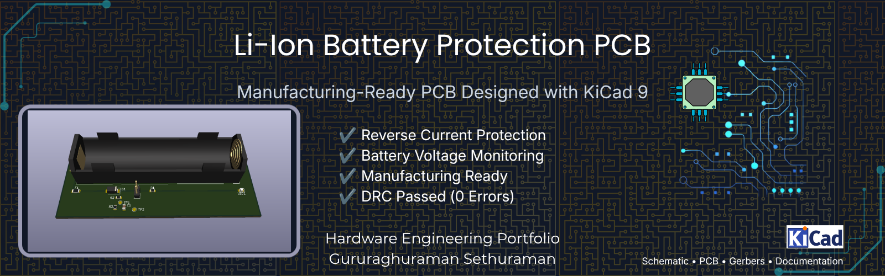
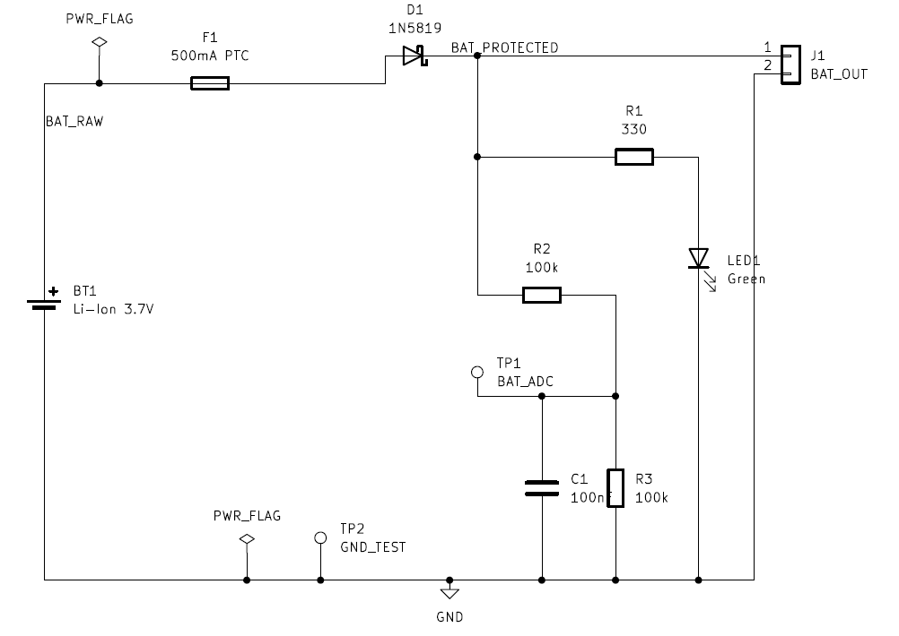
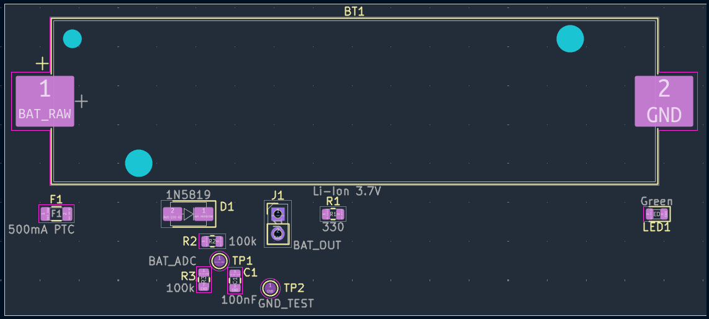
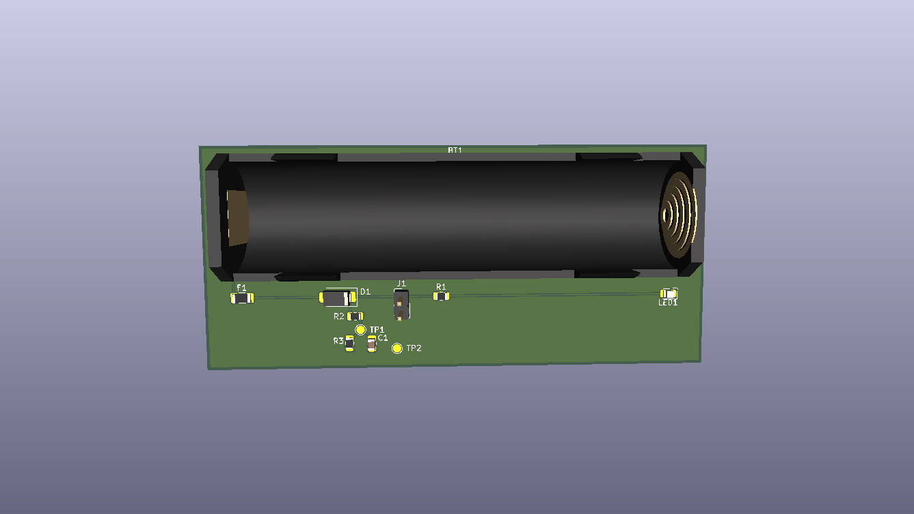
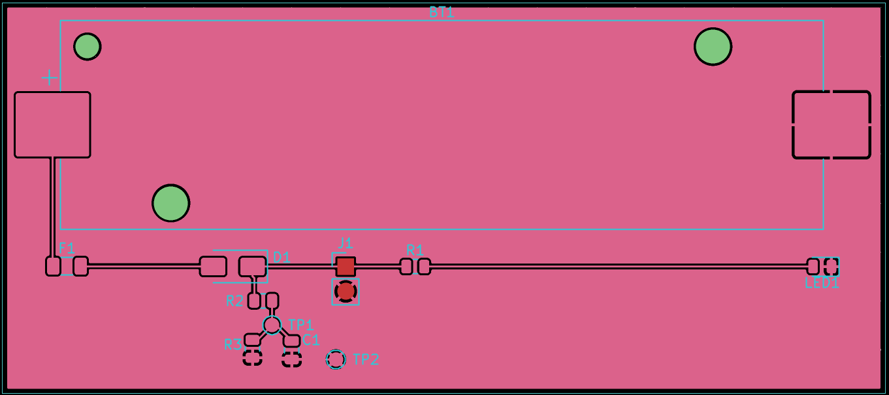

# 🔋 Li-Ion Battery Protection PCB


> A compact single-cell (3.7 V) Li-Ion battery protection and voltage monitoring PCB designed using **KiCad 9**.

This project demonstrates the complete PCB design workflow, including schematic capture, PCB layout, routing, copper pour, design rule verification, Gerber generation, and manufacturing documentation.

---

# 📸 Project Banner



---

# 📖 Project Overview

This PCB provides a simple yet reliable protection and monitoring solution for a single-cell Li-Ion battery.

The design includes:

- Reverse-current protection
- Overcurrent protection
- Battery voltage sensing
- Power indication
- Test points
- Manufacturing-ready outputs

The project was developed to demonstrate practical PCB design skills and follows good engineering documentation practices suitable for a hardware portfolio.

---

# ✨ Features

- ✅ Reverse current protection using **1N5819 Schottky diode**
- ✅ 500 mA resettable Polyfuse
- ✅ Battery voltage divider for MCU ADC
- ✅ 100 nF analog filter capacitor
- ✅ Green power indicator LED
- ✅ BAT_ADC and GND test points
- ✅ 90 mm × 40 mm PCB
- ✅ Ground copper pour
- ✅ Passed KiCad DRC (0 Errors)
- ✅ Manufacturing-ready Gerber files

---

# 📊 PCB Specifications

| Parameter | Value |
|-----------|--------|
| Board Size | 90 mm × 40 mm |
| Layers | 2 |
| Copper Weight | 1 oz |
| Input Voltage | 3.0–4.2 V DC |
| Nominal Voltage | 3.7 V Li-Ion |
| Design Software | KiCad 9 |
| DRC Status | Passed (0 Errors) |

---

# ⚡ Circuit Overview

The battery output first passes through a **500 mA resettable Polyfuse**, providing overcurrent protection.

The protected voltage is then routed through a **1N5819 Schottky diode**, preventing reverse current flow.

The output powers:

- Output connector
- Power indicator LED
- Battery voltage monitoring circuit

Battery voltage is measured using a **100 kΩ / 100 kΩ resistor divider** followed by a **100 nF RC filter**, providing a stable analog voltage for a microcontroller ADC.

---

# 🔄 Functional Block Diagram

```text
Battery
   │
   ▼
PTC Fuse
   │
   ▼
Schottky Diode
   │
   ▼
BAT_OUT
 ├──► LED Indicator
 └──► ADC Voltage Divider
```

---

# 🖼️ Project Images

## Schematic



---

## PCB Top View



---

## 3D PCB View



---

## Gerber Verification



---

# 📁 Repository Structure

```text
docs/
gerbers/
images/
pcb/
references/
releases/
simulation/
```

---

# 📋 Bill of Materials

See **BOM.csv**

---

# ✔ Verification

- ERC Completed
- DRC Passed (0 Errors)
- Copper Pour Verified
- Gerbers Verified
- Drill Files Generated
- Fabrication Package Prepared

---

# 🛠 Software Used

- KiCad 9
- KiCad Gerber Viewer
- LTspice XVII
- Git
- GitHub

---

# 🚀 Future Improvements

- DW01A Battery Protection IC
- USB Type-C Charging Circuit
- Reverse Polarity MOSFET Protection
- Battery Fuel Gauge
- JST Battery Connector
- Current Sense Amplifier
- TVS Surge Protection
- Mounting Holes

---

# 📚 Documentation

- Project Report
- Project Specification
- Design Decisions
- Manufacturing Notes
- Component Datasheets
- PCB Design Checklist

---

# 📄 License

This project is licensed under the **MIT License**.

See the `LICENSE` file for details.

---

## ⭐ Acknowledgements

Designed using **KiCad 9** as part of a hardware engineering portfolio project demonstrating PCB design, documentation, and manufacturing preparation.